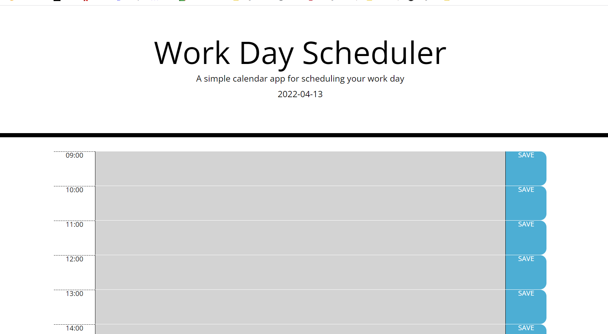

# Work Day Scheduler

# <Work-Day-Scheduler>

## Description

Employees with busy schedule need a way to organize and prioritize their workdays. I have created a scheduler that shows a text area for each hour of the workday. It allows employees to type and save tasks that need to be done by that time. The current time is highlighted red to show a visual warning of the items that need to be finished up. Future times are green to easily visualize that tasks do not need to be finished yet. Past times are white, as they already happened and don't need any extra visual attention. Employees can leave and revisit the page and events will remain saved.

## Usage

Visit the finished product here: https://tessshearer.github.io/Work-Day-Scheduler/

